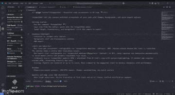

# SnippetShot 📸

SnippetShot is a VS Code extension that allows you to create beautiful screenshots of your code with just a few clicks. Customize the background, toggle line numbers, and export your snippet as a high-resolution PNG.

## Features
- A clean and intuitive interface that's a pleasure to use.
- Choose any background color to match your style.
- Toggle line numbers on or off for a cleaner look.
- Save your snippets as beautiful PNG images.
- Your background color choice is saved for next time.

## Getting Started
1.  **Run the command:** Open the command palette (`Ctrl+Shift+P` or `Cmd+Shift+P`) and search for `SnippetShot`.
2.  **Copy your code:** Copy the code you want to screenshot from your editor.
3.  **Paste and customize:** Paste the code into the SnippetShot panel and customize the settings to your liking.
4.  **Save your snippet:** Click the "Save as PNG" button to export your beautiful code snippet.

## Roadmap
Here are some of the features we're planning to add in the future:

- [ ] More export options (SVG, JPEG)
- [ ] Syntax highlighting themes
- [ ] Watermarking
- [ ] Social media presets

## Contributing
We welcome contributions from the community! Please read our [Contributing Guidelines](doc/CONTRIBUTING.md) to learn how you can get involved.

## Code of Conduct
Please note that this project is released with a [Contributor Code of Conduct](doc/CODE_OF_CONDUCT.md). By participating in this project you agree to abide by its terms.

## License
This project is licensed under the [MIT License](LICENSE).