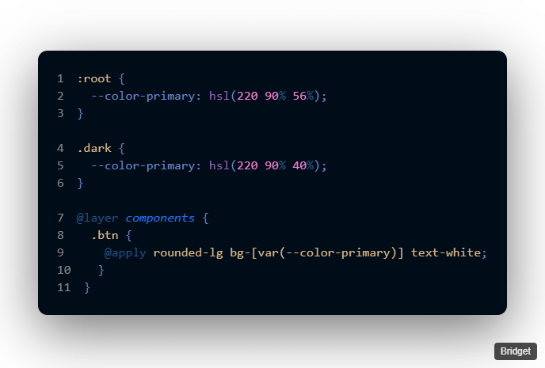

# SnippetShot 📸

SnippetShot is a VS Code extension that allows you to create beautiful screenshots of your code with just a few clicks. Customize the background, toggle line numbers, add optional attribution, and export your snippet as a high-resolution PNG.

## Features
- A clean and intuitive interface that's a pleasure to use.
- Choose between solid colors or beautiful gradients.
- Choose any background color to match your style.
- Toggle line numbers on or off for a cleaner look.
- Save your snippets as beautiful PNG images.
- Keyboard shortcuts: Ctrl+S to save.
- Add custom text or credits to your screenshots.
- Your background color choice is saved for next time.
- Share directly to Twitter/X

## Getting Started
1. Open SnippetShot: Command Palette → `SnippetShot`
2. Selecting automatically copies (VS Code built‑in) and the panel listens for paste.
3. Paste (if needed): Click into the panel and press Ctrl+V.
4. Change background, toggle line numbers, set attribution text.
5. Click the "Save as PNG" button to export or use Ctrl+S.

## Contributing
We welcome contributions from the community! Please read our [Contributing Guidelines](doc/CONTRIBUTING.md) to learn how you can get involved.

## Code of Conduct
Please note that this project is released with a [Contributor Code of Conduct](doc/CODE_OF_CONDUCT.md). By participating in this project you agree to abide by its terms.

## Attribution
SnippetShot is inspired by [Polacode](https://github.com/octref/polacode)

## License
This project is licensed under the [MIT License](LICENSE).